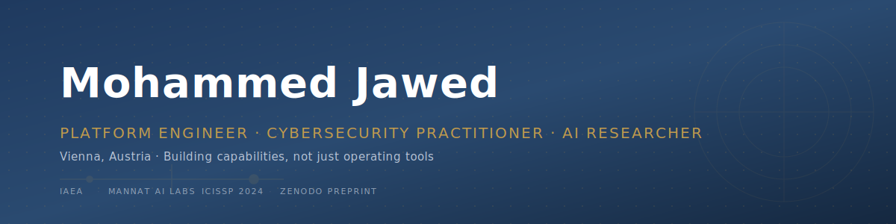

 

 

## About

Vienna-based platform engineer and cybersecurity practitioner. Twelve-plus years inside the UN Common System building CI/CD platforms, security tooling, and custom in-house systems that support an international organisation's mission. On the side, I run [Mannat AI Labs](https://mannatai.com) where I build applied AI systems with human oversight at the core.

I care about honest engineering. Building capabilities, not just operating tools. Systems that stay shipped.

## Featured Work

<table>
<tr>
<td width="50%" valign="top">

### 

**Open-source AI red-team framework.**

An autonomous operator attacks your LLM or AI system, adapts as it finds weaknesses, and returns a reproducible security score with a go/no-go verdict, before you ship. Currently my most ambitious project.

</td>
<td width="50%" valign="top">

### 

**Multi-agent LLM validation with human oversight.**

Three-layer pipeline (primary scorer, auditor agent, human validator) with retrieval-augmented continuous learning. Sole-authored preprint published on Zenodo, June 2026.

</td>
</tr>
<tr>
<td width="50%" valign="top">

### 

**Malware C2 traffic classification engine.**

Peer-reviewed research published at ICISSP 2024 in Rome, recognised as Best Position Paper Candidate. Open-sourced companion codebase.

</td>
<td width="50%" valign="top">

### 

**Self-hosted GST billing for Indian SMBs.**

MIT-licensed. One-command Docker install. Built for owners who want to run their own numbers without handing data to a SaaS.

</td>
</tr>
</table>

## Tech I Actually Use

**Platform Engineering**

**Security & DevSecOps**

**Observability**

**AI & Languages**

## Research and Publications

<table>
<tr>
<td>

**When Disagreement Means Learning (or Bias): Human-Governed Memory Consolidation and Counterfactual Diagnosis in Multi-Agent LLM Scoring**

Zenodo Preprint, June 2026 · Sole Author · CC-BY-4.0
[DOI: 10.5281/zenodo.21025602](https://doi.org/10.5281/zenodo.21025602)

</td>
</tr>
<tr>
<td>

**ArkThor: Threat Categorization Based on Malware's C2 Communication**

ICISSP 2024, Rome · Best Position Paper Candidate
[DOI: 10.5220/0012420200003648](https://doi.org/10.5220/0012420200003648)

</td>
</tr>
<tr>
<td>

**Continuous Security in DevOps Environment**

M.Sc. Thesis, TU Wien, 2019 · Graded Excellent
[Repositum TU Wien](https://repositum.tuwien.at/handle/20.500.12708/8512)

</td>
</tr>
</table>

## Book

<table>
<tr>
<td width="30%" align="center">

</td>
<td>

**MIZAAN — The Balance** (Notion Press, 2024)

A memoir written after the birth of my son. About fatherhood, work, and the in-between years. The Mizaan framework took the same name on purpose.

</td>
</tr>
</table>

## All Public Projects

<!-- REPOS:START -->
_Auto-refreshed daily. Last updated: 2026-07-07._

### **[mizaan-eval](https://github.com/JawedCIA/mizaan-eval)**

Reproducible evaluation for Mizaan: a multi-agent LLM scoring system with human-governed memory consolidation.

`Python`

Live: [mizaan.mannatai.com/](https://mizaan.mannatai.com/)

---

### **[c2-commandcenter](https://github.com/JawedCIA/c2-commandcenter)**

The AI-powered CRM that runs your UAE real-estate brokerage and your public website. Battle-tested in production. Demo: c2.mannatai.com

---

### **[muneem-ji](https://github.com/JawedCIA/muneem-ji)**

Aapka Digital Muneem — self-hosted GST billing, POS, inventory & accounting for Indian small businesses.

`JavaScript`

---

### **[PowerShell-Utility](https://github.com/JawedCIA/PowerShell-Utility)**

_No description provided._

`PowerShell`

---

### **[DevToolBox](https://github.com/JawedCIA/DevToolBox)**

DevToolbox is a personal collection of utilities and tools developed for enhancing efficiency in development, automation, and cybersecurity tasks.

`HTML`

---

### **[AIMLDP](https://github.com/JawedCIA/AIMLDP)**

Collection of AI ML DP Codes

`Jupyter Notebook`

---

### **[Assigment](https://github.com/JawedCIA/Assigment)**

First

`Python`

---

### **[Generative-AI-engineering-fellowship](https://github.com/JawedCIA/Generative-AI-engineering-fellowship)**

Personnel Repository for the OutSkill Generative AI Engineering Fellowship – contains assignments, personal projects, and curated resources related to generative AI, LLMs, and applied machine learning.

`Jupyter Notebook`

---

### **[AI-ML-DL-IITK](https://github.com/JawedCIA/AI-ML-DL-IITK)**

IIT Kanpur Certificate Program on PYTHON for Artificial Intelligence Machine Learning and Deep Learning

`Python`

---

### **[JawedCIA.github.io](https://github.com/JawedCIA/JawedCIA.github.io)**

My Personnel Site  Page

`HTML`

---

### **[ArkThor](https://github.com/JawedCIA/ArkThor)**

Threat Categorization Based on Malware’s C2 Communication in PCAP file

`JavaScript` · `asp-net-core` `capstoneproject` `categorization` `containers`

Live: [arkthor.azurewebsites.net/](https://arkthor.azurewebsites.net/)

---

### **[IITK-eMaster-2024](https://github.com/JawedCIA/IITK-eMaster-2024)**

_No description provided._

`Jupyter Notebook`

<!-- REPOS:END -->

## Currently

<table>
<tr>
<td>

- Preparing for the **(ISC)² CISSP** examination (planned Q4 2026) via ThorTeaches
- **TryHackMe** practitioner track: SEC0 completed, SEC1 in progress · **Guru rank** (Top 1% globally)
- Extending KavachRT and Mizaan toward peer-reviewed venues

</td>
</tr>
</table>

## Background

<table>
<tr>
<td>

- **DevOps Leader**, International Atomic Energy Agency (Vienna) · 2013 – Present
- **eMasters in Cyber Security**, IIT Kanpur · 2025 · Pass with Distinction · CPI 8.67/10
- **M.Sc. Engineering Management**, TU Wien · 2019 · Pass with Distinction
- **IAEA Merit Award** · June 2023

</td>
</tr>
</table>

## Working With Me

Open to conversations about senior platform engineering, security operations, and AI engineering roles, particularly within international organisations, humanitarian sector, or research-oriented environments.

 

*"The most useful engineering discipline is honesty. About what is hard. About what is not yet working. About what the data is telling you."*

 

